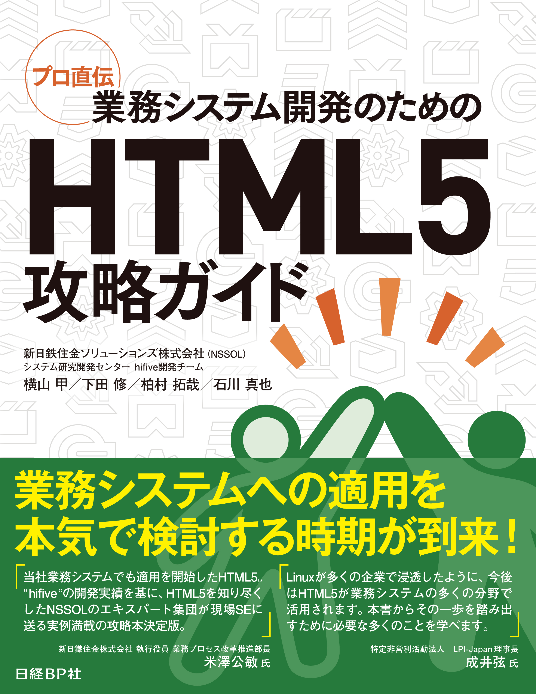

## 本気で考える<br>「HTML5」×「業務システム」

<div style="font-size: 0.6em; text-align: right">
新日鉄住金ソリューションズ株式会社<br>
システム研究開発センター<br>
石川　真也<br>


</div>


---

## 自己紹介
<iframe style="width: 100%; height: 75%; border: none" src="http://meganetaaan.github.io/aboutme/"></iframe>

---

## 書籍が出版されました！



\#htmlhifive #osc16tkを付けて呟いた方にプレゼント！

---

## こんな人向け

* ユーザ企業の情報システム部門の方

* システム内製化を検討中の方

* SIer、ソフトハウス等の技術リーダー

* HTML5を使った開発に興味がある方
 - 初~中級者

Note:

### 想定するシステム
* 企業が業務遂行のために使うWebシステム
* 向上や店舗の現場で従業員が使うWebシステム
* ECサイトやサポートサイトなどのWebサイト

### 想定しないシステム
* 広告
* ゲーム
* 静的サイト

---

# tl;dr
### 今こそHTML5の表現力を<br>業務システムに活用しよう

* Webならではの難しさを解消しつつ「大規模開発」する土壌が整いつつある。

Note:

これからは業務システムも積極的にHTML5を使って開発すべきである、と
私達は考えます。
* 見栄えや操作感の改良
* マルチデバイス対応
* アプリ配布コスト抑制
* ベンダーロックインの回避

業務要件にありがちな
* 大量データの可視化
* リアルタイム通信

さらに
* 3D
* メディアの利用
もできる

---

# HTML5とは

* W3Cが勧告した次世代Web標準
* タグの整理
* 機能追加

Note:

* 業務システムに適用する企業も現れている

例：
* 例１
* 例２
（B2Cでもよいので）派手目の事例

---

# HTML5適用の利点
ここまでできる！HTML5

---

## フォーム入力

---

## ショートカットキー

---

## レスポンシブWebデザイン

---

## オフライン機能

---

## Ajax + History API

---

## CSSアニメーション

---

## データ可視化三種の神器<!-- チャート -->

 ### <span class="highlight">チャート</span>
 ### グリッド
 ### 図形（グラフ）

---

## データ可視化三種の神器<!-- グリッド -->

 ### チャート
 ### <span class="highlight">グリッド</span>
 ### 図形（グラフ）

---

## データ可視化三種の神器<!-- 図形（グラフ） -->

 ### チャート
 ### グリッド
 ### <span class="highlight">図形（グラフ）</span>

---

## HTML5適用の利点

Webアプリが元々持つメリット<br>
×<br>
ネイティブアプリ的な<br>
表現・機能・操作性・パフォーマンス<br>
開発技術基盤の統一

---

### HTML5は、業務システムに<br>どんな貢献ができるだろう？

---

## 棚割り

<div class="example">
  <div class="example-content">
    <iframe width="1000px" height="800px" src="https://www.htmlhifive.com/ja/gallery/planogram/"></iframe>
  </div>
</div>

### 要件

* タブレット、<br>タッチ操作

<hr>

### テクノロジ

* タッチイベント
* canvas, SVG

---

## 日報（フォーム）

<div class="example">
  <div class="example-content">
    <iframe width="900px" height="600px" src="https://hifivemania.github.io/hifive-handson/8/"></iframe>
  </div>
</div>

### 要件

* タブレット、<br>タッチ操作への対応

<hr>

### テクノロジ

* タッチイベント
* canvas, SVG

---

## データグリッド
<div class="example">
  <div class="example-content">
    <iframe width="900px" height="600px" src="https://www.htmlhifive.com/ja/recipe/workflow/complete/"></iframe>
  </div>
</div>

### 要件

* 高パフォーマンス
 - 数百~数万行の<br>データ表示
* 高機能
 - 行/列固定
 - セル結合
 - コピーペースト

<hr>

### テクノロジ

* SVG
* VML

---

## データ視覚化（チャート）
<div class="example">
  <div class="example-content">
    <iframe width="1200px" height="800px" src="https://www.htmlhifive.com/ja/gallery/foreign-exchange/"></iframe>
  </div>
</div>

---

## データ視覚化（グラフ表現）

.example[
<video width="590px" height="400px" src="../mov/h5graph.mp4">
]

### 要件

* 数千以上のノード/エッジ描画
* インタラクティブ性
 - ノード移動・編集など

<hr>

### テクノロジ

* SVG
* 可視範囲のみ描画

---

## データ視覚化（3D表現）
<div class="example small right-col">
  <div class="example-content">
    <iframe class="small" width="1200px" height="800px" src="http://hifive.github.io/hifive-samples/gallery/rain-map/WebContent/index.html"></iframe>
  </div>
</div>

<div class="left-col">

### 要件

* 3D表現
* インタラクティブ性
 - 視点変更・クリック

<hr>

### テクノロジ

* WebGL
 - three.js

<div class="right-col">

---

---

# HTML5を使った開発の進め方

Note:

HTML5で実現可能な表現、機能について、
HTML5がもたらすメリットについて解説シアmした。

リッチなUIを持つシステムの開発は
予定通り開発を進めることが難しくなりがち。

* HTML5開発ならではの考慮点
* 開発の進め方
* 役に立つツール・ライブラリ

1. 要件定義
2. 設計
3. 実装
4. テスト
5. 運用・保守

---

## 業務システムの特長

<div class="left-col">

### <span class="highlight">IT戦略と課題</span>
### 開発
### 運用・保守

</div>


<div class="right-col">

* IT投資における「維持費用」の抑制<br>→攻めの投資への転換

* "SMAC"や"IoT"など振興発展技術軍への対応

* 多数のシステムに対する開発～運用全般に渡る統制
 - 情報漏えいなどセキュリティリスクへの対応も

</div>
 

---

## 業務システムの特長

<div class="left-col">

### IT戦略と課題
### .topic[開発]
### 運用・保守

</div>

<div class="right-col">

* 多人数での役割分担（PM, SE, デザイナ）

* 分散チーム開発

* 外部システムとの接続

* スモールスタート、スパイラル、アジャイル的<br>
開発スタイルの登場

</div>

---

# 業務システムの特長

### IT戦略と課題
### 開発
### .topic[運用・保守]

* 業務の変更に伴って改造されてゆく

* 数年～１０年以上使われる
 - 開発（保守）に携わるメンバーが途中で変わることも多い

---

## HTML5採用のための考慮事項

1. 対象ブラウザ
2. パフォーマンス要求

Note:

# 適、不適の例を挙げる？

### 適する

### 適さない

---

# Web特有の困難

### ブラウザ依存性

---

# ブラウザ依存性
* IEだけ…
 - 遅い
 - 拡大率を変えると挙動がおかしい
 - 印刷レイアウトが崩れる

* JavaScriptという言語
 - 変数の干渉
 - 暗黙の型変換→文字列連結

* CSS
 - 干渉する
 - bootstrapなどが標準の振る舞いを上書きする
  * svg overflow: hiddenの例

Note:
そもそも「ページ」または「フレーム」が最小単位だった昔と比べて
複雑、大規模、コンポーネント化されてきている。

直近5年間の社内チャットのログで
「再現 しない」の検索結果39件

---

# 準備を整える

### ツールを活用する


---

# FW選定のための考慮事項

1. オープンな仕様であるか？
2. 何を解決しようとしているか？
3. 使いこなせそうか？
4. 開発要因は確保できるか？
5. プロダクトとしての継続性があるか？

Note:
レベル感
インフラの人もいる
HTML5良さそうだけど実際どうなの？
jQueryならわかる。
業務システム開発に携わる。

次世代Web標準「HTML5」がW3Cによって勧告されてから2年。
主要なブラウザでその実装が進むに伴い、
HTML5を活用して表現力や操作性を追求したWebサイトが着実に増えてきました。

最近では、JavaScriptフレームワークや、開発生産性を高めるツールなどの登場によって、
「クライアントサイドの大規模開発」を行うための土壌が整いつつあるため、
エンタープライズ分野でも、業務システムへのHTML5の適用を検討する企業が現れ始めています。

そこで、このセミナーでは「本気で考えるHTML5 x 業務システム」をテーマに
　ユーザの視点から「HTML5の機能で、業務システムはどう使いやすくなるのか？」
　開発者の視点から「HTML5を活用した業務システムはどう開発していくべきか？」
というトピックについて、現場での経験談・失敗談を交えて解説します。

・社内システムのWeb化を検討中の開発者
・HTML5の技術について興味がある方
・SIerのWeb開発に興味がある学生の皆さま
は、ぜひご来場ください！

[1366: 下田  (10/06 17:08:08)]
全体的な話、に振ろうってことね？

[1368: 下田  (10/06 17:10:12)]
それはそれでいいと思うけど(今回は「本」があるし)、
ターゲットの選択と言う意味では
・開発的な話
・利用者メリット的な話
どっちメインか、は、わかるようなメッセージを入れとく方がよいんじゃないかと。

[1369: 下田  (10/06 17:12:55)]
OSCの場合、意外とそこが難しい気がする、というのはあるんだけど・・・

html5 confとかだったら、基本的には開発者側（少なくとも「技術的に知ってる・興味ある」人）が大半だから
技術的・開発的な話で一択なんだけど
OSCだと、来る人はそんなにWebに詳しくなかったり基盤屋さんだったりして
突っ込んだ技術面の話をすると・・・という恐れが

[1372: 石川  (10/06 18:20:50)]
技術的な話を深くするつもりはないですが、
「Web特有のつらみ（ブラウザ依存、JavaScript etc）はあります」
という課題感は途中話したいです。
(開発現場での経験談（苦労話）をここで)
その上で「でも大丈夫です！FW・ツール・ES201Xを活用しましょう！ご安心ください！」という流れにもっていきたいです。

---

# Watch us!

* [facebook](http://www.facebook.com/htmlhifive)
* [Twitter](https://twitter.com/htmlhifive)
* [Website](http://www.htmlhifive.com)

---

# 業務システムとHTML5

class: center
# Canvas SVG CSS3 File API IndexedDB  WebSQLDB XHR2  WebSocket  CSS Media Queries デバイス連携 AppCache Web Components  WebRTC  WebWorker etc.etc.

## 要素技術が揃いつつある

---

class: center,middle
# hifiveの取り組み

---
# What’s hifive

* アジャイル・高速プロトタイピング 
* 分散/分担開発の枠組み ユーザー 開発者 
* フレームワーク 
* 高速・高機能部品 
* 開発ガイド 
* 支援ツール 
* 開発者教育 
* サンプルアプリ 
* すぐに使える クラウドサービス 
* HTML5技術の啓 蒙 協働

---

## コンセプト 

### 使い始めるための敷居を低く 
### Webの標準的な仕組みから逸脱しない 
### 開発のサイクルをトータルにサポート 
* ランタイムだけでなく、 ライブラリ、ツール、ドキュメント、教育 

---

## コアフレームワーク
### ツール
### ライブラリ
### ガイド/ドキュメント 

---

## コアフレームワーク 

* Controller層 
* イベントハンドリング 
* メモリリークが起こりにくい ようにクリーンアップ（参照の自動null化） 
* View層 
* テンプレート 
* データバインド 
* （「ボタン」などの 基本UI部品は他のライブラリに） ・Model/Logic層 階層化MVC (PACパターン) ・データオブジェクトの変更管理 ・その他 ・アスペクトによる横断的ログ取得 ・型を保持できる オブジェクトシリアライザ等のUtil 

---
## Hello World 

```JavaScript
(function(){
  var controller = {
    __name: 'myapp.PageController',
    '.button click': function(){
      alert(‘hello world!’);
    }
  };
  h5.core.controller('body', controller);
})();
```
⇒詳細は www.htmlhifive.com 

---
## What's new(ver.1.3)
<!--
* 画面遷移・履歴管理/ルーティング（SPA向け強化） 
* FWとして明示的に「画面」の単位を提供、 画面設計のパターン化を促進 
* 基本的な画面遷移パターンをデフォルトで提供 画面の定期リロードやデータバインドを簡単化 
* ライブクエリ（データ層機能強化） 
* 条件にマッチするオブジェクトを取り出して配列化 
* オブジェクトマネージャからエンティティを出し入れすると 自動的に配列を変更 
* リソース管理 
* 依存性の動的解決 
* ソースコードのマージツール 
* 高機能/高パフォーマンス部品 
-->

---
## ツール 

--
## テンプレートエディタ
* 任意のJSONデータに基づいて テンプレートの出力結果をリアルタイムに表示 実装の効率化 

--
## 開発者ツール
* マウスオーバーしたイベントハンドラの ターゲット要素がハイライト表示される
* アプリの構造をランタイムに可視化 
* 動作中のコントローラの一覧等を表示
* イベントハンドラの表示
* メソッドの呼び出しトレース
* hifive本体の後にJSを追加で1つ読み込むだけ 保守・引継の効率化 

--
## まとめ 
## hifiveはHTML5企業システム開発をサポートします 
## OSS開発サイト 
* GitHub github.com/hifive/hifivemain 
* 開発者サイト 
 - チュートリアルやリファレンスの公開 
 - サンプルの公開 
* 開発・評価用のコードホスティング

## 商標について 
* NS Solutions、NS（ロゴ）、NSSOLは、新日鉄住金ソリューションズ株式会 社の登録商標です。 
* hifive、hifive(ロゴ)は、新日鉄住金ソリューションズ株式会社の登録商 標です。 
* JAVAは､米国ORACLE Corp.の登録商標です｡ 
* HTML5 Logo by W3C. 
* その他本文記載の会社名及び製品名は、それぞれ各社の商標又は登録商標 です。 
